## PRÁCTICA 1 SEGUNDO PARCIAL

  
Evidencia de la práctica con docker

  

## Imágenes de prueba de la práctica 2

###  Evidencia de uso de prisma 

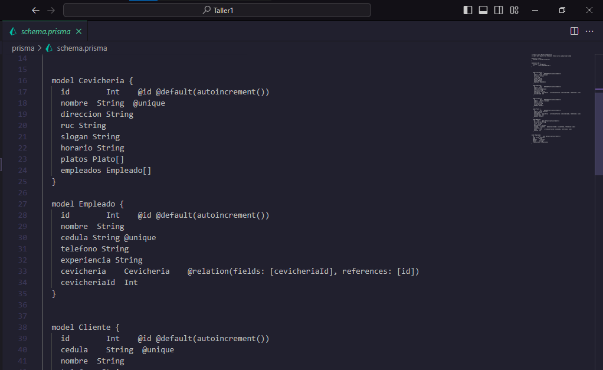

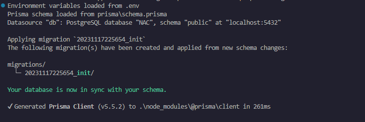

###  Peticiones mediante postman

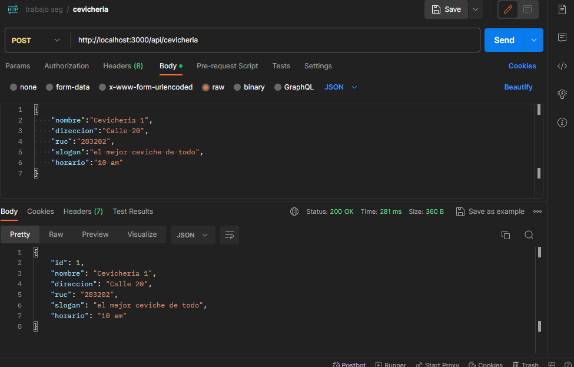
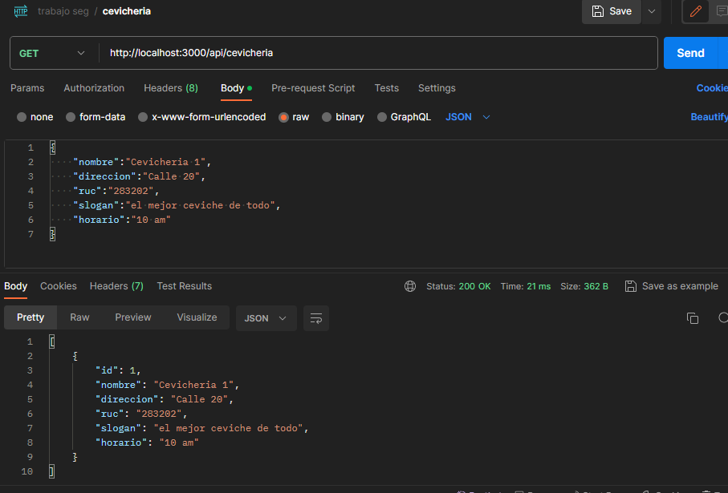
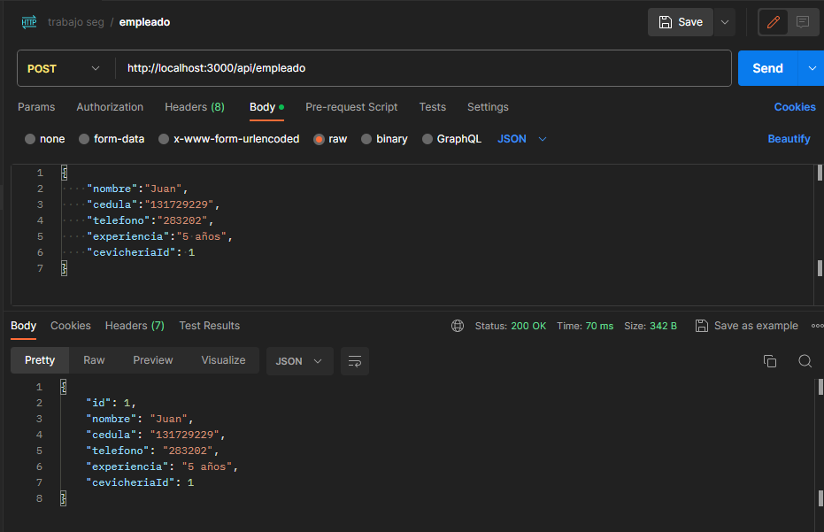
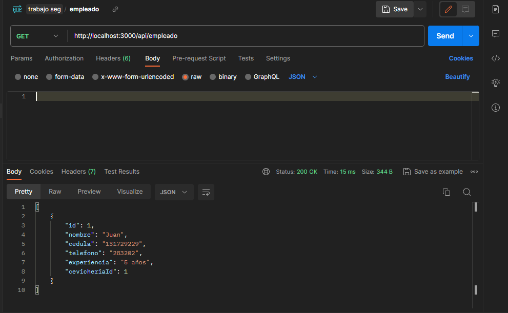
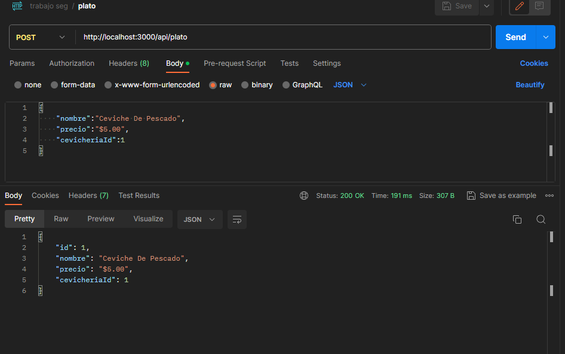
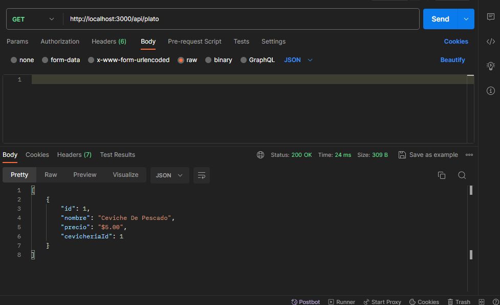
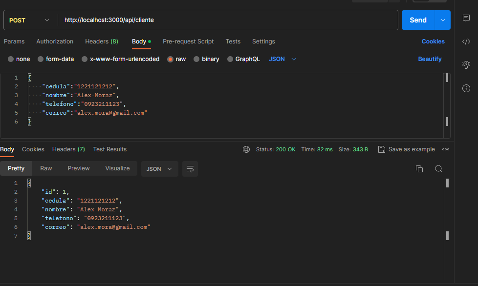
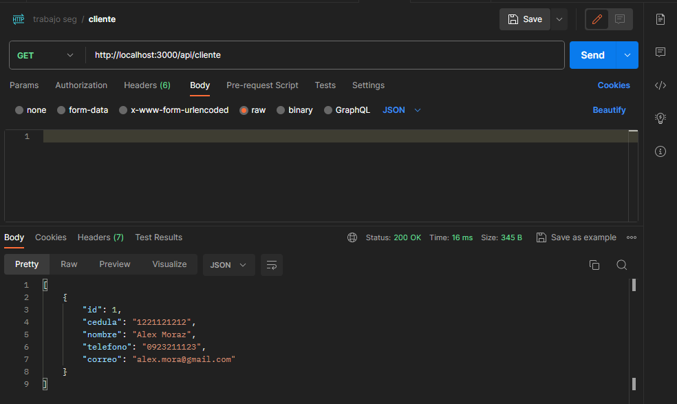
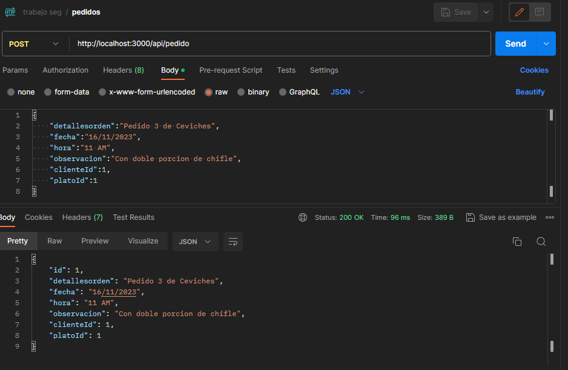
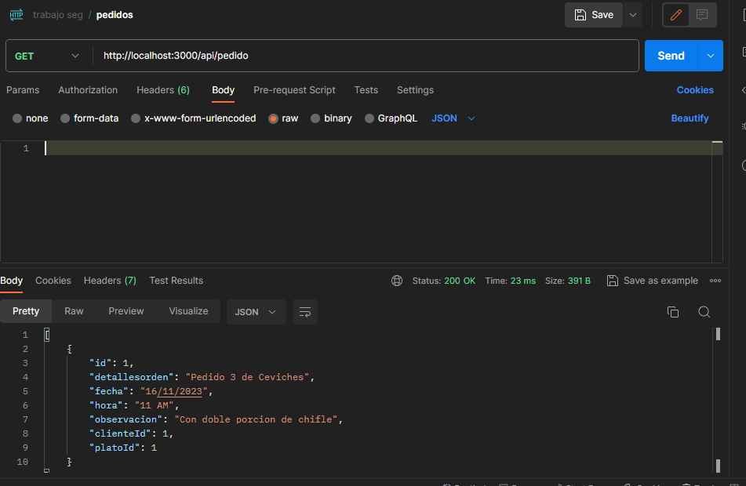

###  Evidencia de dockerizado
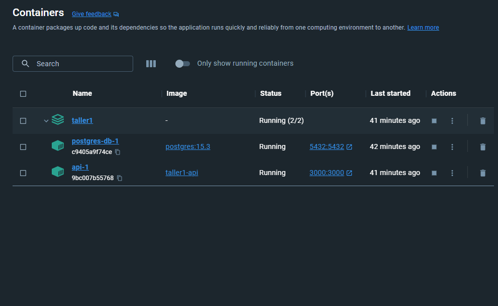
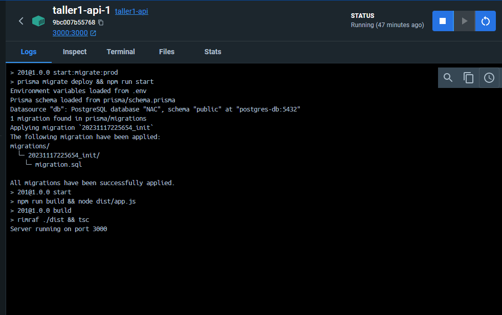

###  Evidencia de consulta con datos relacionados en base de datos Postgres
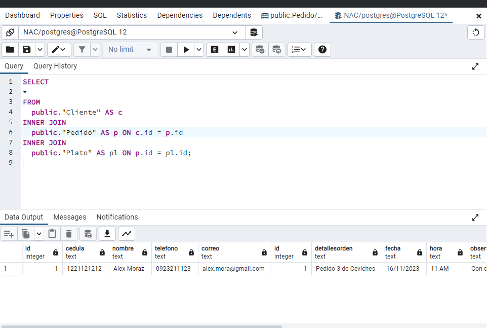

